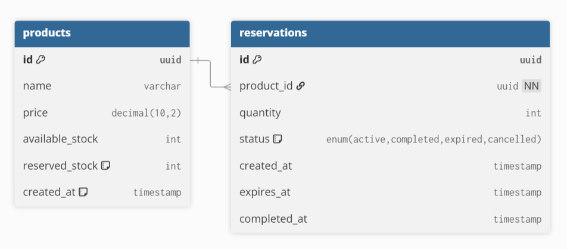

# Flash Sale Stock Reservation System - Architecture Documentation

## Table of Contents
1. [System Overview](#system-overview)
2. [Architecture Diagram](#architecture-diagram)
3. [How Expiration Works](#how-expiration-works)
4. [Concurrency Handling](#concurrency-handling)
5. [Database Schema](#database-schema)
6. [Trade-offs and Limitations](#trade-offs-and-limitations)
7. [Scalability Considerations](#scalability-considerations)
8. [Security Considerations](#security-considerations)

---

## 1. System Overview

### Problem Statement
Build a flash sale system where users can reserve products for exactly 2 minutes. If they don't complete the purchase within this window, the reservation automatically expires and stock is restored.

### Technical Stack
- **Backend**: NestJS (Node.js), TypeORM, PostgreSQL, Redis, Bull Queue
- **Frontend**: Next.js 14 (React), TypeScript, Tailwind CSS, React Query
- **Database**: PostgreSQL 17
- **Message Queue**: Redis with Bull
- **Containerization**: Docker & Docker Compose

### Core Features
- Real-time product listing with stock counts
- 2-minute reservation system with automatic expiration
- Background job processing for expirations
- Concurrency-safe stock management
- Persistent timers that survive page refreshes

---

## 2. Architecture Diagram

